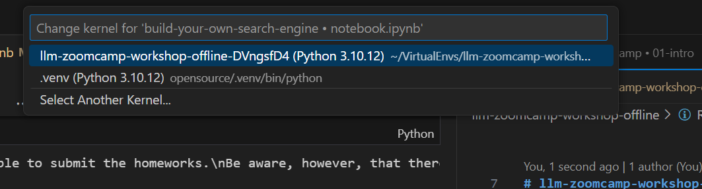
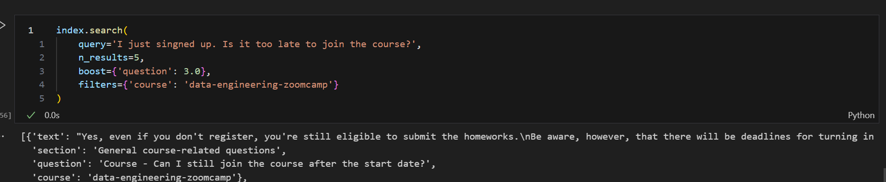
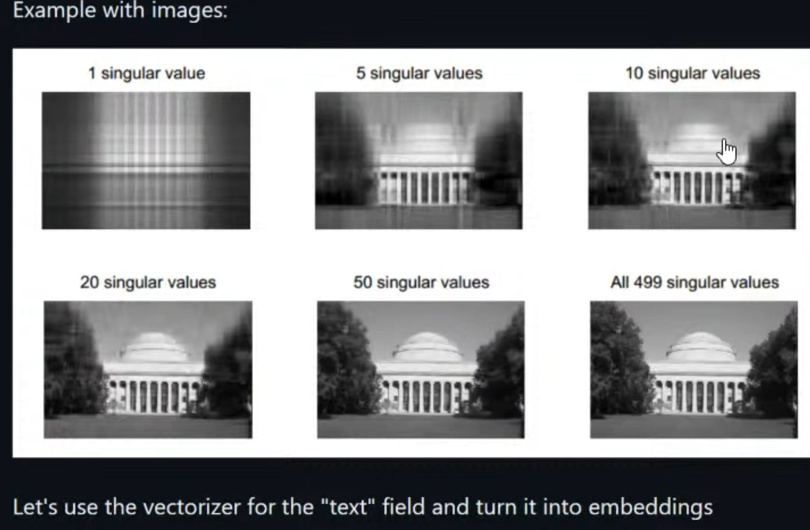

# llm-zoomcamp-workshop-offline

Here there is the pipenv environment for the workshop.
```bash	
cd /workspaces/docker-volume/opensource/zoomcamp/llm-zoomcamp-workshop-offline/
pipenv shell
```
Then select the kernel in jupyter notebook:



## Record track

[https://www.youtube.com/watch?v=nMrGK5QgPVE}(Implement a Search Engine - Alexey Grigorev)

Implement a Search Engine
- in memory index
- A big word doc that will be indexed
- Elastic search used as backend

2 types of searches:
- text search
- semantic / vector search

--- Mins 48.40 - Cosine Similarity 

Review all the the code till 

--- Mins 1.06.10

SVD is decresing the dimensionality of the matrix.

SO the quality decrease. Why do we apply it? Because it is faster to compute the cosine similarity.
It tries to catch the most information in the matrix. It is trying to capture the semantic in the text creating a dense matrix.
In this way we take care of sinonims.

--- Mins 1.27.21
Run the cell 100 do download the model.
